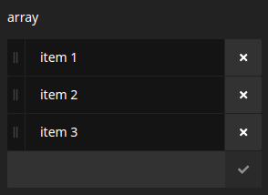

# Prgfx.Neos.StringsEditor

Provides an inspector editor for editing simple `array<string>` properties.

`composer require prgfx/neos-stringseditor`



## Usage
```yaml
My.NodeType:
  properties:
    items:
      type: array<string>
      ui:
        inspector:
          # you can normally omit this, when you use array<string> as property type
          editor: Prgfx.Neos.StringsEditor
          editorOptions:
            placeholder: Placeholder text
            # optional number of items allowed to be entered
            maximumItems: 4
            # by default only unique items are allowed, but you can disable this rule
            unique: false
```
